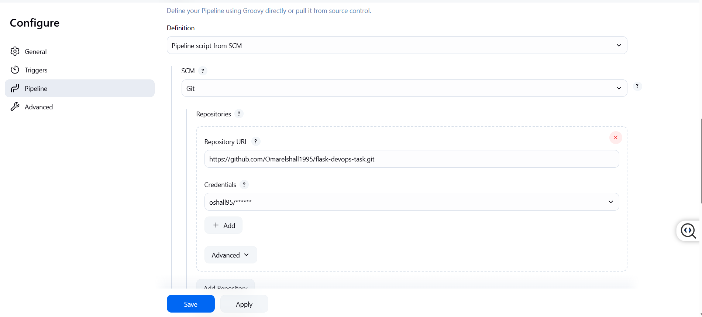
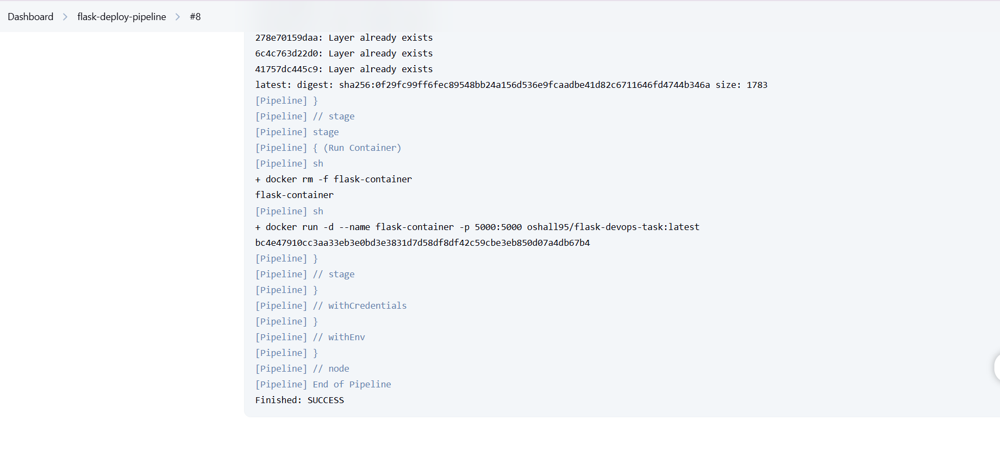

# flask devops task

this repo shows how to deploy a flask app using docker, nginx, jenkins, and terraform. everything was done on an ec2 instance with manual setup and a basic self-signed ssl.

---


## setup steps

### 1. install docker

```bash
sudo apt update
sudo apt install -y docker.io
sudo systemctl start docker
sudo systemctl enable docker
sudo usermod -aG docker $USER
```

### 2. install nginx

```bash
sudo apt install -y nginx
sudo systemctl start nginx
sudo systemctl enable nginx
```

### 3. install jenkins

```bash
curl -fsSL https://pkg.jenkins.io/debian-stable/jenkins.io-2023.key | sudo tee \
  /usr/share/keyrings/jenkins-keyring.asc > /dev/null

echo deb [signed-by=/usr/share/keyrings/jenkins-keyring.asc] \
  https://pkg.jenkins.io/debian-stable binary/ | sudo tee \
  /etc/apt/sources.list.d/jenkins.list > /dev/null

sudo apt update
sudo apt install -y jenkins
sudo systemctl start jenkins
sudo systemctl enable jenkins
```

#### get jenkins password

```bash
sudo cat /var/lib/jenkins/secrets/initialAdminPassword
```

### 4. let jenkins use docker

```bash
sudo usermod -aG docker jenkins
```

---

## flask app

simple flask app that returns a basic message.

```python
from flask import Flask
app = Flask(__name__)
@app.route("/")
def hello():
    return "test webhook"
if __name__ == "__main__":
    app.run(host="0.0.0.0", port=5000)
```

---

## dockerfile

```dockerfile
from python:3.9-slim
workdir /app
copy app.py .
run pip install flask
expose 5000
cmd ["python", "app.py"]
```

---

## nginx config

nginx is used as a reverse proxy with self-signed ssl.

```nginx
server {
    listen 443 ssl;
    server_name 18.117.154.192;

    ssl_certificate /etc/ssl/certs/flask-selfsigned.crt;
    ssl_certificate_key /etc/ssl/private/flask-selfsigned.key;

    location / {
        proxy_pass http://127.0.0.1:5000;
        proxy_set_header Host $host;
        proxy_set_header X-Real-IP $remote_addr;
        proxy_set_header X-Forwarded-For $proxy_add_x_forwarded_for;
        proxy_set_header X-Forwarded-Proto $scheme;
    }
}

server {
    listen 80;
    server_name 18.117.154.192;
    return 301 https://$host$request_uri;
}
```

---

## ssl setup

self-signed ssl cert created using:

```bash
sudo openssl req -x509 -nodes -days 365 \
  -newkey rsa:2048 \
  -keyout /etc/ssl/private/flask-selfsigned.key \
  -out /etc/ssl/certs/flask-selfsigned.crt
```

these are used in the nginx config above.

---

### jenkins ci/cd pipeline screenshots

below are two screenshots showing the jenkins pipeline that builds, pushes, and deploys the flask app:

* pipeline stage view (build, push, deploy):
  

* console output of a successful build:
  

---

## terraform setup

terraform files are inside the terraform/ folder.

* main.tf
* variables.tf
* terraform.tfvars
* outputs.tf

### steps used

```bash
terraform init
terraform import aws_instance.devops_vm i-0ebc8fcccb155df62, because i had done 1 change outside of the terrafoorm state so i had to import it again making sure it matches
terraform plan
terraform apply
```

---

## webhook setup (github or dockerhub)

jenkins webhook url:

```
http://18.117.154.192:8080/github-webhook/
```

* in jenkins job settings: check "github hook trigger"
* in github repo settings: add a webhook pointing to the url above

this allows automatic builds when you push.

---

## automation summary

the ec2 instance was managed through terraform using import to bring in the existing vm. the flask app was containerized with docker and the whole pipeline including build, push, and deployment was handled through jenkins. ssl certificates and nginx reverse proxy were set up manually on the server. jenkins and docker were also installed manually. webhooks were used to trigger builds from github automatically.

---


